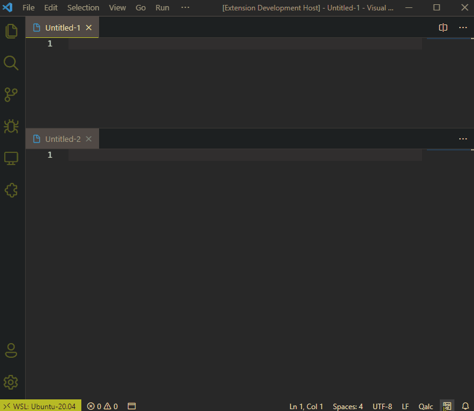

# Qalc

Qalc is an interactive calculator that turns any text document into a math processor. Quickly and easily run simple or complex calculations naturally. Lightweight, powerful, simple.

# Features

* At its core, Qalc is powered by [Math.js](https://mathjs.org/), so you have access to hundreds of built in mathemtical functions, constants, units and conversions
   * But, we've also built on top of Math.js to power things like percentages, currencies, date calculations, natural language, and aggregations
* Qalc evaluates your text as you type it, displaying the result at the end of the line
* Works in Plain Text, Markdown and Qalc files by default, but you can enable it in any type of file
* Syntax highlighting when using the Qalc language mode
* Completely configurable and customizable: colors, alignment, precision, formatting, and more

# Announcements

The exchange rates API I was using just restricted access to certain features unless you pay a subscription fee. For now I have added a free access key when calling the API, which means currency conversions will still work for now, but we no longer have https support, and are limited to 1000 calls per month, which I imagine will be exceeded at some point. I'll work on finding a new free API.

# Release notes

See [change log](CHANGELOG.md).

# Syntax

## Basic Operators

See [Math.js operators](https://mathjs.org/docs/expressions/syntax.html#operators) for all available operators and [Math.js precedence](https://mathjs.org/docs/expressions/syntax.html#precedence) for order of operations.

## Basic Functions

This is just a subset of available functions, see [Math.js function documentation](https://mathjs.org/docs/reference/functions.html) for all available functions. Note: the output of `random()` will update every time the document changes or is reloaded by the UI.

## Aggregations

These are built on top of Math.js and are specific to Qalc. Are you looking for more types of aggregations? Let us know. 

## Dates

Support for dates is built on top of Math.js and is specific to Qalc. Note that any of the relative date keywords, most importantly `time` and `now`, will update every time the document is re-evaluated (any time it changes or the window loads it again). If today is 3/1/2021, `today` will return `3/1/2021` but tomorrow if you load the document again it will return `3/2/2021`.

## Variables and Objects

See [Math.js variables](https://mathjs.org/docs/expressions/syntax.html#constants-and-variables) for more about variables or [Math.js objects](https://mathjs.org/docs/expressions/syntax.html#objects) for more about objects.

## Text

See [Math.js strings](https://mathjs.org/docs/expressions/syntax.html#strings) for more about working with text.

## Constants

This is just a subset. See [Math.js physical constants](https://mathjs.org/docs/datatypes/units.html#physical-constants) and [Math.js constants](https://mathjs.org/docs/reference/constants.html) for all available constants.

## Units and Conversions

See [Math.js units reference](https://mathjs.org/docs/datatypes/units.html#reference) for a list of all units available via Math.js. Qalc also adds a few of its own units:

| Name                | Aliases           | Definition                | Note                                 |
| ------------------- | ----------------- | ------------------------- | ------------------------------------ |
| Pixels              | pixel, pixels, px | 1 inch = 96 px            | Eventually this will be configurable |
| Points              | point, points, pt | 1 px = 0.75 pt            |
| Emphemeral Unit     | em                | 1 em = 16px               | Eventually this will be configurable |
| Currency            |                   |                           | See [currency](#currency) section    |
| Miles per hour      | mph               | 1 miles/hour = 1 mph      |
| Kilometers per hour | kph               | 1 kilometers/hour = 1 kph |

## Currency

Currency data is retrieved from https://exchangeratesapi.io/ and cached for 7 days (eventually this will be configurable). Supported currencies are: `AUD, BGN, BRL, CAD, CHF, CNY, CZK, DKK, EUR, GBP, HKD, HRK, HUF, IDR, ILS, INR, ISK, JPY, KRW, MXN, MYR, NOK, NZD, PHP, PLN, RON, RUB, SEK, SGD, THB, TRY, USD, ZAR`

## Percents

Percents like this are not built into Math.js. We translate `%`, `of`, and `off of` appropriately before passing evaluation to Math.js.

## Functions

You can define your own functions. See [Math.js functions](https://mathjs.org/docs/expressions/syntax.html#functions) for more information.

## Matrices and Ranges

Matrix indexes are one-based, similar to most math applications (differing from most programming languages). For more about matrices, see [Math.js matrices](https://mathjs.org/docs/expressions/syntax.html#matrices).

## Conditionals

All conditional operators are listed in the [Math.js operators](https://mathjs.org/docs/expressions/syntax.html#operators) documentation.

## Other Keywords

The `last` keyword brings up the result of the previous line.

## Pixels/Points/em

These units are not native to Math.js, and for good reason: they are not well defined. Depending on the context, pixels to inches can vary drastically, most commonly in the 72-300 pixels per inch range. Emphemeral units (em) by definition are relative to their parent html element. We've chosen default ratios for converting these units currently, and soon we'll offer the ability to customize them.

## Binary, Hex and Octal

The [Math.js numbers](https://mathjs.org/docs/expressions/syntax.html#numbers) documentation has a little documentation on binary, hex and octal. 

# Settings

Qalc offers a variety of settings that allow you to customize its behavior. These settings are explained below.

| Setting                | Key                              | Default                             | Description                                                                                                                                                                                                                                                                                                                                                                                                                                                                                               |
| ---------------------- | -------------------------------- | ----------------------------------- | --------------------------------------------------------------------------------------------------------------------------------------------------------------------------------------------------------------------------------------------------------------------------------------------------------------------------------------------------------------------------------------------------------------------------------------------------------------------------------------------------------- |
| Output Color           | `qalc.output.color`              |                                     | Set a custom color for output to display in. This can be either a hex value (e.g. \"#FFFFFF\"), rgb value (e.g. \"rgb(255,255,255)\"), or a VSCode ThemeColor id (e.g. \"editor.foreground\", see https://code.visualstudio.com/docs/getstarted/theme-color-reference for available ids). If no color is specified, this falls back to \"terminal.ansiGreen\" to get the green  matching your current UI theme.                                                                                           |
| Show Output Delimiter  | `qalc.output.showDelimiter`      | `false`                             | Controls whether or not to display the delimiter to separate input from output. Default delimiter is \"=\" and can be overriden with the \"qalc.output.delimiter\" setting.                                                                                                                                                                                                                                                                                                                               |
| Output Delimiter       | `qalc.output.delimiter`          | `=`                                 | Delimiter to display between input and output. Can be turned on/off with the \"qalc.output.showDelimiter\" setting.                                                                                                                                                                                                                                                                                                                                                                                       |
| Align Output           | `qalc.output.align`              | `true`                              | Aligns the left edge of output (on) or displays output immediately at the end of an input line (off)                                                                                                                                                                                                                                                                                                                                                                                                      |
| Max Alignment Column   | `qalc.output.maxAlignmentColumn` | `40`                                | When \"qalc.output.align\" is on, this controls the maximum column that results will align on. This is useful if you have, for example, a Markdown document with a few long lines, but don't want your Qalc results displayed too far out for the majority of your shorter lines.                                                                                                                                                                                                                         |
| Display Commas         | `qalc.output.displayCommas`      | `true`                              | Turn this on to display commas in results ($1,000,000), or off to hide commas ($1000000)                                                                                                                                                                                                                                                                                                                                                                                                                  |
| Trim Trailing Zeros    | `qalc.output.trimTrailingZeros`  | `true`                              | Turn this on to trim trailing zeros when using 'fixed' notation. For example, with 'fixed' notation, precision set to 4, and this setting off, 1.12 will display as 1.1200, but with the setting on will display 1.12                                                                                                                                                                                                                                                                                     |
| Notation               | `qalc.output.notation`           | `fixed`                             | Set the notation for display. See https://mathjs.org/docs/reference/functions/format.html for further documentation.                                                                                                                                                                                                                                                                                                                                                                                      |
| Precision              | `qalc.output.precision`          | `2`                                 | Set the precision of the output. In case of notations 'exponential', 'engineering', and 'auto', precision defines the total number of significant digits returned. In case of notation 'fixed', precision defines the number of significant digits after the decimal point. No precision is lost in calculations, only the final display. See https://mathjs.org/docs/reference/functions/format.html for further documentation. Note: When using 'auto' notation, you most likely want to set this to 0. |
| Lower Exponent Bound   | `qalc.output.lowerExponentBound` | `-9`                                | Exponent determining the lower boundary for formatting output with an exponent (e.g. setting this to -2 will format 0.01 as 1e-2.                                                                                                                                                                                                                                                                                                                                                                         |
| Upper Exponent Bound   | `qalc.output.upperExponentBound` | `16`                                | Exponent determining the upper boundary for formatting output with an exponent (e.g. setting this to 2 will format 100 as 1e+2).                                                                                                                                                                                                                                                                                                                                                                          |
| Convert Local Currency | `qalc.currency.convertLocal`     | `true`                              | Turn this on to use your local currency symbol in both your input and output. Works with \"qalc.currency.localSymbol\" and \"qalc.currency.localCode\". For example, setting \"$\" and \"USD\" allows your input to contain \"$100\" which will be evaluated as the equivalent of \"100 USD\", and similarly will display in the output as \"$100\" instead of \"100 USD\".                                                                                                                               |
| Local Currency Symbol  | `qalc.currency.localSymbol`      | `$`                                 | Set your local currency symbol. See \"qalc.currency.convertLocal\" for how this is used\"                                                                                                                                                                                                                                                                                                                                                                                                                 |
| Local Currency Code    | `qalc.currency.localCode`        | `USD`                               | Set your local currency code. See \"qalc.currency.convertLocal\" for how this is used\"                                                                                                                                                                                                                                                                                                                                                                                                                   |
| Temperature Shortcut   | `qalc.shortcuts.temperature`     | `true`                              | When on, enables you to use oF, oC, f and c as substitutes for degF, degC, fahrenheit, and celsius                                                                                                                                                                                                                                                                                                                                                                                                        |
| Enabled Languages      | `qalc.enabledLanguages`          | `["qalc", "plaintext", "markdown"]` | Language identifiers for which to enable Qalc processing on. Keep in mind that Qalc will not examine partial matches, but only full lines. If your full line is not parseable, no output is displayed. For example, if you have a line in a JSON file like \"  'key': '1 + 1'  \", the \"1 + 1\" will not be evaluated because the full line is not parseable. Defaults to [\"qalc\", \"plaintext\", \"markdown\"].                                                                                       |
| Disabled Patterns      | `qalc.disabledPatterns`          | `**/README.md`                      | A list of glob patterns to disable Qalc processing on. These take precedence over \"qalc.enabledLanguages\", so if you have \"markdown\" enabled, but \"README.md\" disabled, you will not get processing on \"README.md\". This is generally useful for any files that might register as \"plaintext\" to VSCode, but you don't want Qalc to run on, like configuration files. Defaults to [\"**/README.md\"]].                                                                                          |
| Global Declarations    | `qalc.globalDeclarations`        | `[]`                                | These are declarations that will be available globally to all Qalc files. They are evaluated at the beginning of a file. For example, if you want to make the \"hypotenuse\" function available to all Qalc files, you would add \"hypotenuse(x,y) = sqrt(x^2 + y^2),\" to this list. Defaults to [].                                                                                                                                                                                                     |

# Commands

Qalc adds some commands to VSCode:

| Title                                      | Command                      | Note                                                                                                                                                                           |
| ------------------------------------------ | ---------------------------- | ------------------------------------------------------------------------------------------------------------------------------------------------------------------------------ |
| Qalc: Copy With Result (with delimiter)    | `qalc.copy.withDelimiter`    | Copies the selected lines (if a selection exists) or the entire editor to the clipboard, including the output from Qalc *with* the delimiter (set via `qalc.output.delimiter`) |
| Qalc: Copy With Result (without delimiter) | `qalc.copy.withoutDelimiter` | Same as `qalc.copy.withDelimiter`, but *without* the delimiter                                                                                                                 |
| Qalc: Copy Result Only                     | `qalc.copy.resultOnly`       | Copies *only* the result of the current line (or lines, if you select many)                                                                                                    |

See these in action:

# Acknowledgments

Forked from [Mathpad](https://github.com/sagebind/mathpad), inspired by [Numi](https://numi.app/) and [Parsify](https://github.com/sagebind/mathpad). I built this because I wanted something cross platform, and integrated with my most common text editor. The theme used in the screenshots and gifs is a slightly modified [Gruvbox](https://github.com/jdinhify/vscode-theme-gruvbox).

